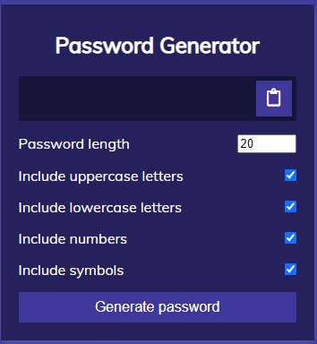

# 03 JavaScript: Password Generator
Challenge Assignment 3, JavaScript Password Generator

## Table of Contents
[Description](#description) |
[User Story](#user-story) |
[Acceptance Criteria](#acceptance-criteria):
&nbsp;[General](#general),
&nbsp;[Technical](#technical),
&nbsp;[Deployment](#deployment),
&nbsp;[Quality](#quality) |
[Review/Deployment](#reviewdeployment) |
[Usage](#usage) |
[Mock-Up](#mock-up) |
[Credits](#credits) <br />

## Description

This week’s Challenge involves creating an application that an employee can use to generate a random password based on user-selected criteria. This app will run in the browser and features dynamically updated HTML and CSS powered by the JavaScript code. It will have a clean and polished user interface and is responsive, which ensures that it adapts to multiple screen sizes.

ASCII character codes used within coding of this project were found here: [American Standard Code for Information Interchange (ASCII) table website](https://theasciicode.com.ar/).

Coding from [Traversy Media's *JavaScript Password Generator*](#credits) tutorial was incorporated into project while keeping existing starter code and mock design.

[back to top](#table-of-contents)

## User Story

```
AS AN employee with access to sensitive data
I WANT to randomly generate a password that meets certain criteria
SO THAT I can create a strong password that provides greater security

```
[back to top](#table-of-contents)

## Acceptance Criteria
### General

```
GIVEN I need a new, secure password
WHEN I click the button to generate a password
THEN I am presented with a series of prompts for password criteria
WHEN prompted for password criteria
THEN I select which criteria to include in the password
WHEN prompted for the length of the password
THEN I choose a length of at least 8 characters and no more than 128 characters
WHEN prompted for character types to include in the password
THEN I choose lowercase, uppercase, numeric, and/or special characters
WHEN I answer each prompt
THEN my input should be validated and at least one character type should be selected
WHEN all prompts are answered
THEN a password is generated that matches the selected criteria
WHEN the password is generated
THEN the password is either displayed in an alert or written to the page

```
[back to top](#table-of-contents)

### Technical

* No errors should be produced in console when inspected using Chrome DevTools.

[back to top](#table-of-contents)

### Deployment

* Application deployed at live URL.
* Application loads with no errors.
* Application GitHub URL submitted.
* GitHub repository contains application code.

[back to top](#table-of-contents)
### Quality
#### Application
* Application user experience is intuitive and easy to navigate.
* Application user interface style is clean and polished.
* Application resembles the mock-up functionality provided in the Challenge instructions.

#### Repository
* Repository has a unique name.
* Repository follows best practices for file structure and naming conventions.
* Repository follows best practices for class/id naming conventions, indentation, quality comments, etc.
* Repository contains multiple descriptive commit messages.
* Repository contains quality README file with  description, screenshot, link to deployed application.

[back to top](#table-of-contents)
## Review/Deployment

You are required to submit BOTH of the following for review:

* Deployed Application: &nbsp; [Live URL](https://baxters4karma.github.io/password-generator/)

* GitHub Repository: &nbsp; [GitHub Repository URL](https://github.com/baxters4karma/password-generator)

[back to top](#table-of-contents)
## Usage
Employee will use this application to generate a random password based on user-selected criteria. Employee(s) will run the application's clean and polished user interface within the browser, ensuring responsiveness is built in for adaption to multiple screen sizes.

Please note this website was designed with a mobile-first mindset and uses the following media queries for responsive display on mobile phone and tablet screens:
* Mobile Phones (max-width = 500px)
* Tablets (max-width = 690px)

[back to top](#table-of-contents)
## Mock-Up
Image showing the web application's appearance and functionality:


A 'Copy Password' button was added to better the user experience.

The initial design was left to match mock-up, would present the look below as an enhancement to the project.



[back to top](#table-of-contents)
## Credits

* Module 3: JavaScript Bootcampspot Material
* Module 3: Class Activities
* [Module 3 JavaScript Challenge: Password Generator](https://courses.bootcampspot.com/courses/798/assignments/17676?module_item_id=306550)
* [Traversy, B. Traversy Media [Oct 21, 2019]. JavaScript Password Generator Tutorial](https://www.youtube.com/watch?v=duNmhKgtcsI)
* [American Standard Code for Information Interchange (ASCII) table website](https://theasciicode.com.ar/)

[back to top](#table-of-contents)
- - -
© 2021 Trilogy Education Services, LLC, a 2U, Inc. brand. Confidential and Proprietary. All Rights Reserved.